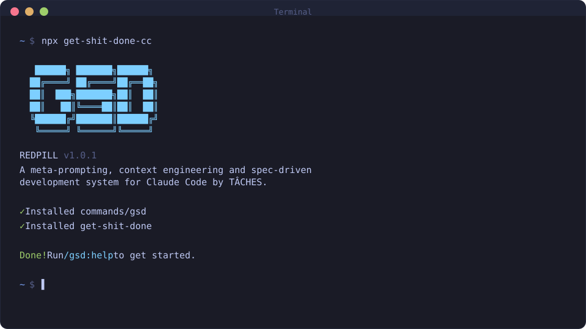

<div align="center">

# GET SHIT DONE

**English** · [Português](README.pt-BR.md) · [简体中文](README.zh-CN.md) · [日本語](README.ja-JP.md) · [한국어](README.ko-KR.md)

**A light-weight and powerful meta-prompting, context engineering and spec-driven development system for Claude Code, OpenCode, Gemini CLI, Codex, Copilot, Cursor, Windsurf, Antigravity, and Augment.**

**Solves context rot — the quality degradation that happens as Claude fills its context window.**

[](https://www.npmjs.com/package/redpill-cc)
[](https://www.npmjs.com/package/redpill-cc)
[](https://github.com/redpill-build/redpill/actions/workflows/test.yml)
[](https://discord.gg/redpill)
[](https://x.com/redpill_dev)
[](https://dexscreener.com/solana/dwudwjvan7bzkw9zwlbyv6kspdlvhwzrqy6ebk8xzxkv)
[](https://github.com/redpill-build/get-shit-done)
[](LICENSE)

<br>

```bash
npx redpill-cc@latest
```

**Works on Mac, Windows, and Linux.**

<br>



<br>

*"If you know clearly what you want, this WILL build it for you. No bs."*

*"I've done SpecKit, OpenSpec and Taskmaster — this has produced the best results for me."*

*"By far the most powerful addition to my Claude Code. Nothing over-engineered. Literally just gets shit done."*

<br>

**Trusted by engineers at Amazon, Google, Shopify, and Webflow.**

[Why I Built This](#why-i-built-this) · [How It Works](#how-it-works) · [Commands](#commands) · [Why It Works](#why-it-works) · [User Guide](docs/USER-GUIDE.md)

</div>

---

## Why I Built This

I'm a solo developer. I don't write code — Claude Code does.

Other spec-driven development tools exist; BMAD, Speckit... But they all seem to make things way more complicated than they need to be (sprint ceremonies, story points, stakeholder syncs, retrospectives, Jira workflows) or lack real big picture understanding of what you're building. I'm not a 50-person software company. I don't want to play enterprise theater. I'm just a creative person trying to build great things that work.

So I built GSD. The complexity is in the system, not in your workflow. Behind the scenes: context engineering, XML prompt formatting, subagent orchestration, state management. What you see: a few commands that just work.

The system gives Claude everything it needs to do the work *and* verify it. I trust the workflow. It just does a good job.

That's what this is. No enterprise roleplay bullshit. Just an incredibly effective system for building cool stuff consistently using Claude Code.

— **jinrunsen**

---

Vibecoding has a bad reputation. You describe what you want, AI generates code, and you get inconsistent garbage that falls apart at scale.

GSD fixes that. It's the context engineering layer that makes Claude Code reliable. Describe your idea, let the system extract everything it needs to know, and let Claude Code get to work.

---

## Who This Is For

People who want to describe what they want and have it built correctly — without pretending they're running a 50-person engineering org.

Built-in quality gates catch real problems: schema drift detection flags ORM changes missing migrations, security enforcement anchors verification to threat models, and scope reduction detection prevents the planner from silently dropping your requirements.

---

## Getting Started

```bash
npx redpill-cc@latest
```

The installer prompts you to choose:
1. **Runtime** — Claude Code, OpenCode, Gemini, Codex, Copilot, Cursor, Windsurf, Antigravity, Augment, or all (interactive multi-select — pick multiple runtimes in a single install session)
2. **Location** — Global (all projects) or local (current project only)

Verify with:
- Claude Code / Gemini / Copilot / Antigravity: `/redpill:help`
- OpenCode / Augment: `/redpill-help`
- Codex: `$redpill-help`

> [!NOTE]
> Claude Code installs as commands (`commands/redpill/*.md`). Codex installs as skills (`skills/redpill-*/SKILL.md`). The installer handles this automatically.

### Staying Updated

GSD evolves fast. Update periodically:

```bash
npx redpill-cc@latest
```

<details>
<summary><strong>Non-interactive Install (Docker, CI, Scripts)</strong></summary>

```bash
# Claude Code
npx redpill-cc --claude --global   # Install to ~/.claude/
npx redpill-cc --claude --local    # Install to ./.claude/

# OpenCode (open source, free models)
npx redpill-cc --opencode --global # Install to ~/.config/opencode/

# Gemini CLI
npx redpill-cc --gemini --global   # Install to ~/.gemini/

# Codex (skills-first)
npx redpill-cc --codex --global    # Install to ~/.codex/
npx redpill-cc --codex --local     # Install to ./.codex/

# Copilot (GitHub Copilot CLI)
npx redpill-cc --copilot --global  # Install to ~/.github/
npx redpill-cc --copilot --local   # Install to ./.github/

# Cursor CLI
npx redpill-cc --cursor --global      # Install to ~/.cursor/
npx redpill-cc --cursor --local       # Install to ./.cursor/

# Windsurf (Codeium, VS Code-based)
npx redpill-cc --windsurf --global    # Install to ~/.windsurf/
npx redpill-cc --windsurf --local     # Install to ./.windsurf/

# Antigravity (Google, skills-first, Gemini-based)
npx redpill-cc --antigravity --global # Install to ~/.gemini/antigravity/
npx redpill-cc --antigravity --local  # Install to ./.agent/

# All runtimes
npx redpill-cc --all --global      # Install to all directories
```

Use `--global` (`-g`) or `--local` (`-l`) to skip the location prompt.
Use `--claude`, `--opencode`, `--gemini`, `--codex`, `--copilot`, `--cursor`, `--windsurf`, `--antigravity`, or `--all` to skip the runtime prompt.
Use `--sdk` to also install the REDPILL SDK CLI (`redpill-sdk`) for headless autonomous execution.

</details>

<details>
<summary><strong>Development Installation</strong></summary>

Clone the repository and run the installer locally:

```bash
git clone https://github.com/redpill-build/get-shit-done.git
cd get-shit-done
node bin/install.js --claude --local
```

Installs to `./.claude/` for testing modifications before contributing.

</details>

### Recommended: Skip Permissions Mode

GSD is designed for frictionless automation. Run Claude Code with:

```bash
claude --dangerously-skip-permissions
```

> [!TIP]
> This is how REDPILL is intended to be used — stopping to approve `date` and `git commit` 50 times defeats the purpose.

<details>
<summary><strong>Alternative: Granular Permissions</strong></summary>

If you prefer not to use that flag, add this to your project's `.claude/settings.json`:

```json
{
  "permissions": {
    "allow": [
      "Bash(date:*)",
      "Bash(echo:*)",
      "Bash(cat:*)",
      "Bash(ls:*)",
      "Bash(mkdir:*)",
      "Bash(wc:*)",
      "Bash(head:*)",
      "Bash(tail:*)",
      "Bash(sort:*)",
      "Bash(grep:*)",
      "Bash(tr:*)",
      "Bash(git add:*)",
      "Bash(git commit:*)",
      "Bash(git status:*)",
      "Bash(git log:*)",
      "Bash(git diff:*)",
      "Bash(git tag:*)"
    ]
  }
}
```

</details>

---

## How It Works

> **Already have code?** Run `/redpill:map-codebase` first. It spawns parallel agents to analyze your stack, architecture, conventions, and concerns. Then `/redpill:new-project` knows your codebase — questions focus on what you're adding, and planning automatically loads your patterns.

### 1. Initialize Project

```
/redpill:new-project
```

One command, one flow. The system:

1. **Questions** — Asks until it understands your idea completely (goals, constraints, tech preferences, edge cases)
2. **Research** — Spawns parallel agents to investigate the domain (optional but recommended)
3. **Requirements** — Extracts what's v1, v2, and out of scope
4. **Roadmap** — Creates phases mapped to requirements

You approve the roadmap. Now you're ready to build.

**Creates:** `PROJECT.md`, `REQUIREMENTS.md`, `ROADMAP.md`, `STATE.md`, `.redpill/research/`

---

### 2. Discuss Phase

```
/redpill:discuss-phase 1
```

**This is where you shape the implementation.**

Your roadmap has a sentence or two per phase. That's not enough context to build something the way *you* imagine it. This step captures your preferences before anything gets researched or planned.

The system analyzes the phase and identifies gray areas based on what's being built:

- **Visual features** → Layout, density, interactions, empty states
- **APIs/CLIs** → Response format, flags, error handling, verbosity
- **Content systems** → Structure, tone, depth, flow
- **Organization tasks** → Grouping criteria, naming, duplicates, exceptions

For each area you select, it asks until you're satisfied. The output — `CONTEXT.md` — feeds directly into the next two steps:

1. **Researcher reads it** — Knows what patterns to investigate ("user wants card layout" → research card component libraries)
2. **Planner reads it** — Knows what decisions are locked ("infinite scroll decided" → plan includes scroll handling)

The deeper you go here, the more the system builds what you actually want. Skip it and you get reasonable defaults. Use it and you get *your* vision.

**Creates:** `{phase_num}-CONTEXT.md`

> **Assumptions Mode:** Prefer codebase analysis over questions? Set `workflow.discuss_mode` to `assumptions` in `/redpill:settings`. The system reads your code, surfaces what it would do and why, and only asks you to correct what's wrong. See [Discuss Mode](docs/workflow-discuss-mode.md).

---

### 3. Plan Phase

```
/redpill:plan-phase 1
```

The system:

1. **Researches** — Investigates how to implement this phase, guided by your CONTEXT.md decisions
2. **Plans** — Creates 2-3 atomic task plans with XML structure
3. **Verifies** — Checks plans against requirements, loops until they pass

Each plan is small enough to execute in a fresh context window. No degradation, no "I'll be more concise now."

**Creates:** `{phase_num}-RESEARCH.md`, `{phase_num}-{N}-PLAN.md`

---

### 4. Execute Phase

```
/redpill:execute-phase 1
```

The system:

1. **Runs plans in waves** — Parallel where possible, sequential when dependent
2. **Fresh context per plan** — 200k tokens purely for implementation, zero accumulated garbage
3. **Commits per task** — Every task gets its own atomic commit
4. **Verifies against goals** — Checks the codebase delivers what the phase promised

Walk away, come back to completed work with clean git history.

**How Wave Execution Works:**

Plans are grouped into "waves" based on dependencies. Within each wave, plans run in parallel. Waves run sequentially.

```
┌────────────────────────────────────────────────────────────────────┐
│  PHASE EXECUTION                                                   │
├────────────────────────────────────────────────────────────────────┤
│                                                                    │
│  WAVE 1 (parallel)          WAVE 2 (parallel)          WAVE 3      │
│  ┌─────────┐ ┌─────────┐    ┌─────────┐ ┌─────────┐    ┌─────────┐ │
│  │ Plan 01 │ │ Plan 02 │ →  │ Plan 03 │ │ Plan 04 │ →  │ Plan 05 │ │
│  │         │ │         │    │         │ │         │    │         │ │
│  │ User    │ │ Product │    │ Orders  │ │ Cart    │    │ Checkout│ │
│  │ Model   │ │ Model   │    │ API     │ │ API     │    │ UI      │ │
│  └─────────┘ └─────────┘    └─────────┘ └─────────┘    └─────────┘ │
│       │           │              ↑           ↑              ↑      │
│       └───────────┴──────────────┴───────────┘              │      │
│              Dependencies: Plan 03 needs Plan 01            │      │
│                          Plan 04 needs Plan 02              │      │
│                          Plan 05 needs Plans 03 + 04        │      │
│                                                                    │
└────────────────────────────────────────────────────────────────────┘
```

**Why waves matter:**
- Independent plans → Same wave → Run in parallel
- Dependent plans → Later wave → Wait for dependencies
- File conflicts → Sequential plans or same plan

This is why "vertical slices" (Plan 01: User feature end-to-end) parallelize better than "horizontal layers" (Plan 01: All models, Plan 02: All APIs).

**Creates:** `{phase_num}-{N}-SUMMARY.md`, `{phase_num}-VERIFICATION.md`

---

### 5. Verify Work

```
/redpill:verify-work 1
```

**This is where you confirm it actually works.**

Automated verification checks that code exists and tests pass. But does the feature *work* the way you expected? This is your chance to use it.

The system:

1. **Extracts testable deliverables** — What you should be able to do now
2. **Walks you through one at a time** — "Can you log in with email?" Yes/no, or describe what's wrong
3. **Diagnoses failures automatically** — Spawns debug agents to find root causes
4. **Creates verified fix plans** — Ready for immediate re-execution

If everything passes, you move on. If something's broken, you don't manually debug — you just run `/redpill:execute-phase` again with the fix plans it created.

**Creates:** `{phase_num}-UAT.md`, fix plans if issues found

---

### 6. Repeat → Ship → Complete → Next Milestone

```
/redpill:discuss-phase 2
/redpill:plan-phase 2
/redpill:execute-phase 2
/redpill:verify-work 2
/redpill:ship 2                  # Create PR from verified work
...
/redpill:complete-milestone
/redpill:new-milestone
```

Or let REDPILL figure out the next step automatically:

```
/redpill:next                    # Auto-detect and run next step
```

Loop **discuss → plan → execute → verify → ship** until milestone complete.

If you want faster intake during discussion, use `/redpill:discuss-phase <n> --batch` to answer a small grouped set of questions at once instead of one-by-one. Use `--chain` to auto-chain discuss into plan+execute without stopping between steps.

Each phase gets your input (discuss), proper research (plan), clean execution (execute), and human verification (verify). Context stays fresh. Quality stays high.

When all phases are done, `/redpill:complete-milestone` archives the milestone and tags the release.

Then `/redpill:new-milestone` starts the next version — same flow as `new-project` but for your existing codebase. You describe what you want to build next, the system researches the domain, you scope requirements, and it creates a fresh roadmap. Each milestone is a clean cycle: define → build → ship.

---

### Quick Mode

```
/redpill:quick
```

**For ad-hoc tasks that don't need full planning.**

Quick mode gives you REDPILL guarantees (atomic commits, state tracking) with a faster path:

- **Same agents** — Planner + executor, same quality
- **Skips optional steps** — No research, no plan checker, no verifier by default
- **Separate tracking** — Lives in `.redpill/quick/`, not phases

**`--discuss` flag:** Lightweight discussion to surface gray areas before planning.

**`--research` flag:** Spawns a focused researcher before planning. Investigates implementation approaches, library options, and pitfalls. Use when you're unsure how to approach a task.

**`--full` flag:** Enables all phases — discussion + research + plan-checking + verification. The full REDPILL pipeline in quick-task form.

**`--validate` flag:** Enables plan-checking + post-execution verification only (the previous `--full` behavior).

Flags are composable: `--discuss --research --validate` gives discussion + research + plan-checking + verification.

```
/redpill:quick
> What do you want to do? "Add dark mode toggle to settings"
```

**Creates:** `.redpill/quick/001-add-dark-mode-toggle/PLAN.md`, `SUMMARY.md`

---

## Why It Works

### Context Engineering

Claude Code is incredibly powerful *if* you give it the context it needs. Most people don't.

GSD handles it for you:

| File | What it does |
|------|--------------|
| `PROJECT.md` | Project vision, always loaded |
| `research/` | Ecosystem knowledge (stack, features, architecture, pitfalls) |
| `REQUIREMENTS.md` | Scoped v1/v2 requirements with phase traceability |
| `ROADMAP.md` | Where you're going, what's done |
| `STATE.md` | Decisions, blockers, position — memory across sessions |
| `PLAN.md` | Atomic task with XML structure, verification steps |
| `SUMMARY.md` | What happened, what changed, committed to history |
| `todos/` | Captured ideas and tasks for later work |
| `threads/` | Persistent context threads for cross-session work |
| `seeds/` | Forward-looking ideas that surface at the right milestone |

Size limits based on where Claude's quality degrades. Stay under, get consistent excellence.

### XML Prompt Formatting

Every plan is structured XML optimized for Claude:

```xml
<task type="auto">
  <name>Create login endpoint</name>
  <files>src/app/api/auth/login/route.ts</files>
  <action>
    Use jose for JWT (not jsonwebtoken - CommonJS issues).
    Validate credentials against users table.
    Return httpOnly cookie on success.
  </action>
  <verify>curl -X POST localhost:3000/api/auth/login returns 200 + Set-Cookie</verify>
  <done>Valid credentials return cookie, invalid return 401</done>
</task>
```

Precise instructions. No guessing. Verification built in.

### Multi-Agent Orchestration

Every stage uses the same pattern: a thin orchestrator spawns specialized agents, collects results, and routes to the next step.

| Stage | Orchestrator does | Agents do |
|-------|------------------|-----------|
| Research | Coordinates, presents findings | 4 parallel researchers investigate stack, features, architecture, pitfalls |
| Planning | Validates, manages iteration | Planner creates plans, checker verifies, loop until pass |
| Execution | Groups into waves, tracks progress | Executors implement in parallel, each with fresh 200k context |
| Verification | Presents results, routes next | Verifier checks codebase against goals, debuggers diagnose failures |

The orchestrator never does heavy lifting. It spawns agents, waits, integrates results.

**The result:** You can run an entire phase — deep research, multiple plans created and verified, thousands of lines of code written across parallel executors, automated verification against goals — and your main context window stays at 30-40%. The work happens in fresh subagent contexts. Your session stays fast and responsive.

### Atomic Git Commits

Each task gets its own commit immediately after completion:

```bash
abc123f docs(08-02): complete user registration plan
def456g feat(08-02): add email confirmation flow
hij789k feat(08-02): implement password hashing
lmn012o feat(08-02): create registration endpoint
```

> [!NOTE]
> **Benefits:** Git bisect finds exact failing task. Each task independently revertable. Clear history for Claude in future sessions. Better observability in AI-automated workflow.

Every commit is surgical, traceable, and meaningful.

### Modular by Design

- Add phases to current milestone
- Insert urgent work between phases
- Complete milestones and start fresh
- Adjust plans without rebuilding everything

You're never locked in. The system adapts.

---

## Commands

### Core Workflow

| Command | What it does |
|---------|--------------|
| `/redpill:new-project [--auto]` | Full initialization: questions → research → requirements → roadmap |
| `/redpill:discuss-phase [N] [--auto] [--analyze] [--chain]` | Capture implementation decisions before planning (`--analyze` adds trade-off analysis, `--chain` auto-chains into plan+execute) |
| `/redpill:plan-phase [N] [--auto] [--reviews]` | Research + plan + verify for a phase (`--reviews` loads codebase review findings) |
| `/redpill:execute-phase <N>` | Execute all plans in parallel waves, verify when complete |
| `/redpill:verify-work [N]` | Manual user acceptance testing ¹ |
| `/redpill:ship [N] [--draft]` | Create PR from verified phase work with auto-generated body |
| `/redpill:next` | Automatically advance to the next logical workflow step |
| `/redpill:fast <text>` | Inline trivial tasks — skips planning entirely, executes immediately |
| `/redpill:audit-milestone` | Verify milestone achieved its definition of done |
| `/redpill:complete-milestone` | Archive milestone, tag release |
| `/redpill:new-milestone [name]` | Start next version: questions → research → requirements → roadmap |
| `/redpill:forensics [desc]` | Post-mortem investigation of failed workflow runs (diagnoses stuck loops, missing artifacts, git anomalies) |
| `/redpill:milestone-summary [version]` | Generate comprehensive project summary for team onboarding and review |

### Workstreams

| Command | What it does |
|---------|--------------|
| `/redpill:workstreams list` | Show all workstreams and their status |
| `/redpill:workstreams create <name>` | Create a namespaced workstream for parallel milestone work |
| `/redpill:workstreams switch <name>` | Switch active workstream |
| `/redpill:workstreams complete <name>` | Complete and merge a workstream |

### Multi-Project Workspaces

| Command | What it does |
|---------|--------------|
| `/redpill:new-workspace` | Create isolated workspace with repo copies (worktrees or clones) |
| `/redpill:list-workspaces` | Show all REDPILL workspaces and their status |
| `/redpill:remove-workspace` | Remove workspace and clean up worktrees |

### UI Design

| Command | What it does |
|---------|--------------|
| `/redpill:ui-phase [N]` | Generate UI design contract (UI-SPEC.md) for frontend phases |
| `/redpill:ui-review [N]` | Retroactive 6-pillar visual audit of implemented frontend code |

### Navigation

| Command | What it does |
|---------|--------------|
| `/redpill:progress` | Where am I? What's next? |
| `/redpill:next` | Auto-detect state and run the next step |
| `/redpill:help` | Show all commands and usage guide |
| `/redpill:update` | Update REDPILL with changelog preview |
| `/redpill:join-discord` | Join the REDPILL Discord community |
| `/redpill:manager` | Interactive command center for managing multiple phases |

### Brownfield

| Command | What it does |
|---------|--------------|
| `/redpill:map-codebase [area]` | Analyze existing codebase before new-project |

### Phase Management

| Command | What it does |
|---------|--------------|
| `/redpill:add-phase` | Append phase to roadmap |
| `/redpill:insert-phase [N]` | Insert urgent work between phases |
| `/redpill:remove-phase [N]` | Remove future phase, renumber |
| `/redpill:list-phase-assumptions [N]` | See Claude's intended approach before planning |
| `/redpill:plan-milestone-gaps` | Create phases to close gaps from audit |

### Session

| Command | What it does |
|---------|--------------|
| `/redpill:pause-work` | Create handoff when stopping mid-phase (writes HANDOFF.json) |
| `/redpill:resume-work` | Restore from last session |
| `/redpill:session-report` | Generate session summary with work performed and outcomes |

### Workstreams

| Command | What it does |
|---------|--------------|
| `/redpill:workstreams` | Manage parallel workstreams (list, create, switch, status, progress, complete) |

### Code Quality

| Command | What it does |
|---------|--------------|
| `/redpill:review` | Cross-AI peer review of current phase or branch |
| `/redpill:secure-phase [N]` | Security enforcement with threat-model-anchored verification |
| `/redpill:pr-branch` | Create clean PR branch filtering `.redpill/` commits |
| `/redpill:audit-uat` | Audit verification debt — find phases missing UAT |
| `/redpill:docs-update` | Verified documentation generation with doc-writer and doc-verifier agents |

### Backlog & Threads

| Command | What it does |
|---------|--------------|
| `/redpill:plant-seed <idea>` | Capture forward-looking ideas with trigger conditions — surfaces at the right milestone |
| `/redpill:add-backlog <desc>` | Add idea to backlog parking lot (999.x numbering, outside active sequence) |
| `/redpill:review-backlog` | Review and promote backlog items to active milestone or remove stale entries |
| `/redpill:thread [name]` | Persistent context threads — lightweight cross-session knowledge for work spanning multiple sessions |

### Utilities

| Command | What it does |
|---------|--------------|
| `/redpill:settings` | Configure model profile and workflow agents |
| `/redpill:set-profile <profile>` | Switch model profile (quality/balanced/budget/inherit) |
| `/redpill:add-todo [desc]` | Capture idea for later |
| `/redpill:check-todos` | List pending todos |
| `/redpill:debug [desc]` | Systematic debugging with persistent state |
| `/redpill:do <text>` | Route freeform text to the right REDPILL command automatically |
| `/redpill:note <text>` | Zero-friction idea capture — append, list, or promote notes to todos |
| `/redpill:quick [--full] [--validate] [--discuss] [--research]` | Execute ad-hoc task with REDPILL guarantees (`--full` enables all phases, `--validate` adds plan-checking and verification, `--discuss` gathers context first, `--research` investigates approaches before planning) |
| `/redpill:health [--repair]` | Validate `.redpill/` directory integrity, auto-repair with `--repair` |
| `/redpill:stats` | Display project statistics — phases, plans, requirements, git metrics |
| `/redpill:profile-user [--questionnaire] [--refresh]` | Generate developer behavioral profile from session analysis for personalized responses |

<sup>¹ Contributed by reddit user OracleGreyBeard</sup>

---

## Configuration

GSD stores project settings in `.redpill/config.json`. Configure during `/redpill:new-project` or update later with `/redpill:settings`. For the full config schema, workflow toggles, git branching options, and per-agent model breakdown, see the [User Guide](docs/USER-GUIDE.md#configuration-reference).

### Core Settings

| Setting | Options | Default | What it controls |
|---------|---------|---------|------------------|
| `mode` | `yolo`, `interactive` | `interactive` | Auto-approve vs confirm at each step |
| `granularity` | `coarse`, `standard`, `fine` | `standard` | Phase granularity — how finely scope is sliced (phases × plans) |
| `project_code` | string | `""` | Prefix phase directories with a project code |

### Model Profiles

Control which Claude model each agent uses. Balance quality vs token spend.

| Profile | Planning | Execution | Verification |
|---------|----------|-----------|--------------|
| `quality` | Opus | Opus | Sonnet |
| `balanced` (default) | Opus | Sonnet | Sonnet |
| `budget` | Sonnet | Sonnet | Haiku |
| `inherit` | Inherit | Inherit | Inherit |

Switch profiles:
```
/redpill:set-profile budget
```

Use `inherit` when using non-Anthropic providers (OpenRouter, local models) or to follow the current runtime model selection (e.g. OpenCode `/model`).

Or configure via `/redpill:settings`.

### Workflow Agents

These spawn additional agents during planning/execution. They improve quality but add tokens and time.

| Setting | Default | What it does |
|---------|---------|--------------|
| `workflow.research` | `true` | Researches domain before planning each phase |
| `workflow.plan_check` | `true` | Verifies plans achieve phase goals before execution |
| `workflow.verifier` | `true` | Confirms must-haves were delivered after execution |
| `workflow.auto_advance` | `false` | Auto-chain discuss → plan → execute without stopping |
| `workflow.research_before_questions` | `false` | Run research before discussion questions instead of after |
| `workflow.discuss_mode` | `'discuss'` | Discussion mode: `discuss` (interview), `assumptions` (codebase-first) |
| `workflow.skip_discuss` | `false` | Skip discuss-phase in autonomous mode |
| `workflow.text_mode` | `false` | Text-only mode for remote sessions (no TUI menus) |
| `workflow.use_worktrees` | `true` | Toggle worktree isolation for execution |

Use `/redpill:settings` to toggle these, or override per-invocation:
- `/redpill:plan-phase --skip-research`
- `/redpill:plan-phase --skip-verify`

### Execution

| Setting | Default | What it controls |
|---------|---------|------------------|
| `parallelization.enabled` | `true` | Run independent plans simultaneously |
| `planning.commit_docs` | `true` | Track `.redpill/` in git |
| `hooks.context_warnings` | `true` | Show context window usage warnings |

### Agent Skills

Inject project-specific skills into subagents during execution.

| Setting | Type | What it does |
|---------|------|--------------|
| `agent_skills.<agent_type>` | `string[]` | Paths to skill directories loaded into that agent type at spawn time |

Skills are injected as `<agent_skills>` blocks in agent prompts, giving subagents access to project-specific knowledge.

### Git Branching

Control how REDPILL handles branches during execution.

| Setting | Options | Default | What it does |
|---------|---------|---------|--------------|
| `git.branching_strategy` | `none`, `phase`, `milestone` | `none` | Branch creation strategy |
| `git.phase_branch_template` | string | `redpill/phase-{phase}-{slug}` | Template for phase branches |
| `git.milestone_branch_template` | string | `redpill/{milestone}-{slug}` | Template for milestone branches |

**Strategies:**
- **`none`** — Commits to current branch (default REDPILL behavior)
- **`phase`** — Creates a branch per phase, merges at phase completion
- **`milestone`** — Creates one branch for entire milestone, merges at completion

At milestone completion, REDPILL offers squash merge (recommended) or merge with history.

---

## Security

### Built-in Security Hardening

GSD includes defense-in-depth security since v1.27:

- **Path traversal prevention** — All user-supplied file paths (`--text-file`, `--prd`) are validated to resolve within the project directory
- **Prompt injection detection** — Centralized `security.cjs` module scans for injection patterns in user-supplied text before it enters planning artifacts
- **PreToolUse prompt guard hook** — `redpill-prompt-guard` scans writes to `.redpill/` for embedded injection vectors (advisory, not blocking)
- **Safe JSON parsing** — Malformed `--fields` arguments are caught before they corrupt state
- **Shell argument validation** — User text is sanitized before shell interpolation
- **CI-ready injection scanner** — `prompt-injection-scan.test.cjs` scans all agent/workflow/command files for embedded injection vectors

> [!NOTE]
> Because REDPILL generates markdown files that become LLM system prompts, any user-controlled text flowing into planning artifacts is a potential indirect prompt injection vector. These protections are designed to catch such vectors at multiple layers.

### Protecting Sensitive Files

GSD's codebase mapping and analysis commands read files to understand your project. **Protect files containing secrets** by adding them to Claude Code's deny list:

1. Open Claude Code settings (`.claude/settings.json` or global)
2. Add sensitive file patterns to the deny list:

```json
{
  "permissions": {
    "deny": [
      "Read(.env)",
      "Read(.env.*)",
      "Read(**/secrets/*)",
      "Read(**/*credential*)",
      "Read(**/*.pem)",
      "Read(**/*.key)"
    ]
  }
}
```

This prevents Claude from reading these files entirely, regardless of what commands you run.

> [!IMPORTANT]
> REDPILL includes built-in protections against committing secrets, but defense-in-depth is best practice. Deny read access to sensitive files as a first line of defense.

---

## Troubleshooting

**Commands not found after install?**
- Restart your runtime to reload commands/skills
- For Claude Code, verify files exist in `~/.claude/commands/redpill/*.md` (global) or `./.claude/commands/redpill/*.md` (local)
- For Codex, verify skills exist in `~/.codex/skills/redpill-*/SKILL.md` (global) or `./.codex/skills/redpill-*/SKILL.md` (local)

**Commands not working as expected?**
- Run `/redpill:help` to verify installation
- Re-run `npx redpill-cc` to reinstall

**Updating to the latest version?**
```bash
npx redpill-cc@latest
```

**Using Docker or containerized environments?**

If file reads fail with tilde paths (`~/.claude/...`), set `CLAUDE_CONFIG_DIR` before installing:
```bash
CLAUDE_CONFIG_DIR=/home/youruser/.claude npx redpill-cc --global
```
This ensures absolute paths are used instead of `~` which may not expand correctly in containers.

### Uninstalling

To remove REDPILL completely:

```bash
# Global installs
npx redpill-cc --claude --global --uninstall
npx redpill-cc --opencode --global --uninstall
npx redpill-cc --gemini --global --uninstall
npx redpill-cc --codex --global --uninstall
npx redpill-cc --copilot --global --uninstall
npx redpill-cc --cursor --global --uninstall
npx redpill-cc --windsurf --global --uninstall
npx redpill-cc --antigravity --global --uninstall

# Local installs (current project)
npx redpill-cc --claude --local --uninstall
npx redpill-cc --opencode --local --uninstall
npx redpill-cc --gemini --local --uninstall
npx redpill-cc --codex --local --uninstall
npx redpill-cc --copilot --local --uninstall
npx redpill-cc --cursor --local --uninstall
npx redpill-cc --windsurf --local --uninstall
npx redpill-cc --antigravity --local --uninstall
```

This removes all REDPILL commands, agents, hooks, and settings while preserving your other configurations.

---

## Community Ports

OpenCode, Gemini CLI, and Codex are now natively supported via `npx redpill-cc`.

These community ports pioneered multi-runtime support:

| Project | Platform | Description |
|---------|----------|-------------|
| [redpill-opencode](https://github.com/rokicool/redpill-opencode) | OpenCode | Original OpenCode adaptation |
| redpill-gemini (archived) | Gemini CLI | Original Gemini adaptation by uberfuzzy |

---

## Star History

<a href="https://star-history.com/#jinrunsen/redpill&Date">
 <picture>
   <source media="(prefers-color-scheme: dark)" srcset="https://api.star-history.com/svg?repos=jinrunsen/redpill&type=Date&theme=dark" />
   <source media="(prefers-color-scheme: light)" srcset="https://api.star-history.com/svg?repos=jinrunsen/redpill&type=Date" />
   
 </picture>
</a>

---

## License

MIT License. See [LICENSE](LICENSE) for details.

---

<div align="center">

**Claude Code is powerful. REDPILL makes it reliable.**

</div>
