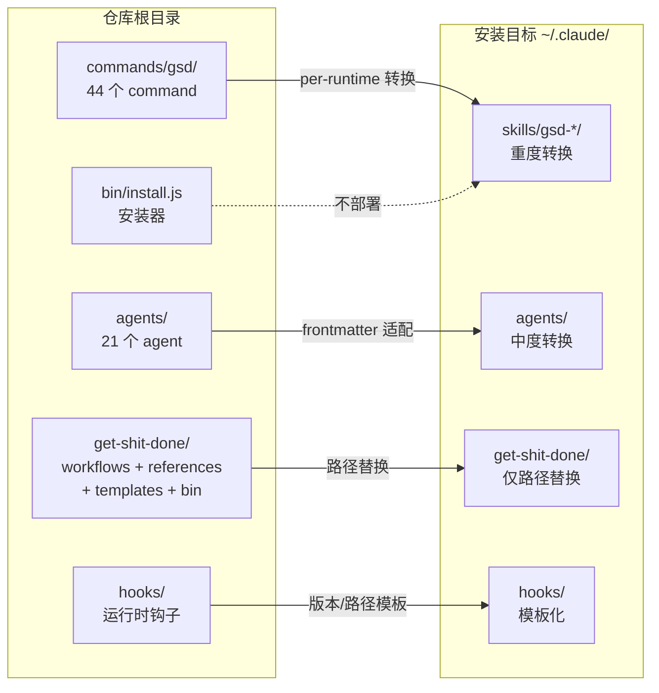

这个目录结构的设计核心是**部署拓扑**——仓库中的每个顶层目录在安装时有不同的目标位置、不同的转换规则、以及不同的 runtime 可见性。

## 安装时的映射关系

以 Claude Code 全局安装为例，`install()` 函数对每个目录做了完全不同的处理：

```
仓库目录              安装目标                        转换方式
─────────────────────────────────────────────────────────────────
commands/gsd/    →   ~/.claude/skills/gsd-*/SKILL.md   重度转换（frontmatter重写、格式转换）
agents/          →   ~/.claude/agents/                  中度转换（frontmatter适配）
get-shit-done/   →   ~/.claude/get-shit-done/           轻度转换（仅路径替换）
hooks/dist/      →   ~/.claude/hooks/                   模板化（版本号、config dir）
bin/install.js   →   不部署（安装器本身）
sdk/             →   不部署（可选，独立 npm 包）
``` [1](#3-0) 

而且不同 runtime 对 `commands/` 的转换方式完全不同：

| Runtime | `commands/gsd/*.md` 变成什么 |
|---------|---------------------------|
| Claude Code | `skills/gsd-*/SKILL.md`（技能格式） |
| OpenCode | `command/gsd-*.md`（扁平化） |
| Gemini | `commands/gsd/*.toml`（TOML 格式） |
| Codex | `skills/gsd-*/SKILL.md` + TOML config |
| Copilot | `skills/gsd-*/SKILL.md`（工具名映射） | [2](#3-1) 

而 `get-shit-done/` 在所有 runtime 中都只做路径替换（`~/.claude/` → `~/.gemini/` 等），结构保持不变。 [3](#3-2) 

## 为什么 `get-shit-done/` 必须独立

关键原因是**稳定的内部引用路径**。所有 command 文件都通过硬编码路径引用 `get-shit-done/` 下的资源：

```markdown
@~/.claude/get-shit-done/workflows/new-project.md
@~/.claude/get-shit-done/references/questioning.md
@~/.claude/get-shit-done/templates/project.md
``` [4](#3-3) 

几乎所有 command 都遵循这个模式——command 本身只是一个 thin wrapper，真正的逻辑在 workflow 中： [5](#3-4) 

如果把 `workflows/`、`references/`、`templates/` 放在 `commands/` 里面，它们会被 installer 当作 command 文件一起转换（frontmatter 重写、TOML 转换等），这会破坏它们的内容。`get-shit-done/` 作为独立目录，installer 只对其做路径替换，保持内容完整。

## 为什么 `commands/` 和 `agents/` 在外层

这对应了 AI runtime 的 **API 边界**：

| 目录 | Runtime 可见性 | 作用 |
|------|--------------|------|
| `commands/gsd/` | **用户可见** — 注册为 slash command / skill，用户直接调用 | 入口点 |
| `agents/` | **Runtime 可见** — 注册为可 spawn 的 subagent | 专用 agent 定义 |
| `get-shit-done/` | **Runtime 不可见** — 只被 command/agent 内部 `@` 引用 | 内部实现 | [6](#3-5) 

架构文档中的分层图清楚地展示了这个设计：

```
USER → COMMAND LAYER (commands/) → WORKFLOW LAYER (get-shit-done/workflows/)
                                        ↓
                                   AGENT LAYER (agents/)
                                        ↓
                                   CLI TOOLS LAYER (get-shit-done/bin/)
                                        ↓
                                   FILE SYSTEM (.planning/)
``` [7](#3-6) 

## 为什么 `bin/` 在外层

仓库根目录的 `bin/` 只包含 `install.js`——这是安装器本身，通过 `npx get-shit-done-cc` 执行，**不会被部署到目标目录**。它和 `get-shit-done/bin/`（包含 `gsd-tools.cjs`，会被部署）是完全不同的东西。 [8](#3-7) 

## 总结

这个目录结构本质上是按**部署边界**划分的：



每个顶层目录对应一种不同的安装策略和转换规则，这就是它们必须分开的原因。如果全部放在 `get-shit-done/` 里面，installer 就无法对不同类型的文件施加不同的转换逻辑。

### Citations

**File:** bin/install.js (L3393-3428)
```javascript
function copyWithPathReplacement(srcDir, destDir, pathPrefix, runtime, isCommand = false, isGlobal = false) {
  const isOpencode = runtime === 'opencode';
  const isCodex = runtime === 'codex';
  const isCopilot = runtime === 'copilot';
  const isAntigravity = runtime === 'antigravity';
  const isCursor = runtime === 'cursor';
  const isWindsurf = runtime === 'windsurf';
  const isAugment = runtime === 'augment';
  const dirName = getDirName(runtime);

  // Clean install: remove existing destination to prevent orphaned files
  if (fs.existsSync(destDir)) {
    fs.rmSync(destDir, { recursive: true });
  }
  fs.mkdirSync(destDir, { recursive: true });

  const entries = fs.readdirSync(srcDir, { withFileTypes: true });

  for (const entry of entries) {
    const srcPath = path.join(srcDir, entry.name);
    const destPath = path.join(destDir, entry.name);

    if (entry.isDirectory()) {
      copyWithPathReplacement(srcPath, destPath, pathPrefix, runtime, isCommand, isGlobal);
    } else if (entry.name.endsWith('.md')) {
      // Replace ~/.claude/ and $HOME/.claude/ and ./.claude/ with runtime-appropriate paths
      // Skip generic replacement for Copilot — convertClaudeToCopilotContent handles all paths
      let content = fs.readFileSync(srcPath, 'utf8');
      if (!isCopilot && !isAntigravity) {
        const globalClaudeRegex = /~\/\.claude\//g;
        const globalClaudeHomeRegex = /\$HOME\/\.claude\//g;
        const localClaudeRegex = /\.\/\.claude\//g;
        content = content.replace(globalClaudeRegex, pathPrefix);
        content = content.replace(globalClaudeHomeRegex, pathPrefix);
        content = content.replace(localClaudeRegex, `./${dirName}/`);
      }
```

**File:** bin/install.js (L4517-4527)
```javascript
function install(isGlobal, runtime = 'claude') {
  const isOpencode = runtime === 'opencode';
  const isGemini = runtime === 'gemini';
  const isCodex = runtime === 'codex';
  const isCopilot = runtime === 'copilot';
  const isAntigravity = runtime === 'antigravity';
  const isCursor = runtime === 'cursor';
  const isWindsurf = runtime === 'windsurf';
  const isAugment = runtime === 'augment';
  const dirName = getDirName(runtime);
  const src = path.join(__dirname, '..');
```

**File:** bin/install.js (L4570-4689)
```javascript
  // OpenCode uses command/ (flat), Codex uses skills/, Claude/Gemini use commands/gsd/
  if (isOpencode) {
    // OpenCode: flat structure in command/ directory
    const commandDir = path.join(targetDir, 'command');
    fs.mkdirSync(commandDir, { recursive: true });
    
    // Copy commands/gsd/*.md as command/gsd-*.md (flatten structure)
    const gsdSrc = path.join(src, 'commands', 'gsd');
    copyFlattenedCommands(gsdSrc, commandDir, 'gsd', pathPrefix, runtime);
    if (verifyInstalled(commandDir, 'command/gsd-*')) {
      const count = fs.readdirSync(commandDir).filter(f => f.startsWith('gsd-')).length;
      console.log(`  ${green}✓${reset} Installed ${count} commands to command/`);
    } else {
      failures.push('command/gsd-*');
    }
  } else if (isCodex) {
    const skillsDir = path.join(targetDir, 'skills');
    const gsdSrc = path.join(src, 'commands', 'gsd');
    copyCommandsAsCodexSkills(gsdSrc, skillsDir, 'gsd', pathPrefix, runtime);
    const installedSkillNames = listCodexSkillNames(skillsDir);
    if (installedSkillNames.length > 0) {
      console.log(`  ${green}✓${reset} Installed ${installedSkillNames.length} skills to skills/`);
    } else {
      failures.push('skills/gsd-*');
    }
  } else if (isCopilot) {
    const skillsDir = path.join(targetDir, 'skills');
    const gsdSrc = path.join(src, 'commands', 'gsd');
    copyCommandsAsCopilotSkills(gsdSrc, skillsDir, 'gsd', isGlobal);
    if (fs.existsSync(skillsDir)) {
      const count = fs.readdirSync(skillsDir, { withFileTypes: true })
        .filter(e => e.isDirectory() && e.name.startsWith('gsd-')).length;
      if (count > 0) {
        console.log(`  ${green}✓${reset} Installed ${count} skills to skills/`);
      } else {
        failures.push('skills/gsd-*');
      }
    } else {
      failures.push('skills/gsd-*');
    }
  } else if (isAntigravity) {
    const skillsDir = path.join(targetDir, 'skills');
    const gsdSrc = path.join(src, 'commands', 'gsd');
    copyCommandsAsAntigravitySkills(gsdSrc, skillsDir, 'gsd', isGlobal);
    if (fs.existsSync(skillsDir)) {
      const count = fs.readdirSync(skillsDir, { withFileTypes: true })
        .filter(e => e.isDirectory() && e.name.startsWith('gsd-')).length;
      if (count > 0) {
        console.log(`  ${green}✓${reset} Installed ${count} skills to skills/`);
      } else {
        failures.push('skills/gsd-*');
      }
    } else {
      failures.push('skills/gsd-*');
    }
  } else if (isCursor) {
    const skillsDir = path.join(targetDir, 'skills');
    const gsdSrc = path.join(src, 'commands', 'gsd');
    copyCommandsAsCursorSkills(gsdSrc, skillsDir, 'gsd', pathPrefix, runtime);
    const installedSkillNames = listCodexSkillNames(skillsDir); // reuse — same dir structure
    if (installedSkillNames.length > 0) {
      console.log(`  ${green}✓${reset} Installed ${installedSkillNames.length} skills to skills/`);
    } else {
      failures.push('skills/gsd-*');
    }
  } else if (isWindsurf) {
    const skillsDir = path.join(targetDir, 'skills');
    const gsdSrc = path.join(src, 'commands', 'gsd');
    copyCommandsAsWindsurfSkills(gsdSrc, skillsDir, 'gsd', pathPrefix, runtime);
    const installedSkillNames = listCodexSkillNames(skillsDir); // reuse — same dir structure
    if (installedSkillNames.length > 0) {
      console.log(`  ${green}✓${reset} Installed ${installedSkillNames.length} skills to skills/`);
    } else {
      failures.push('skills/gsd-*');
    }
  } else if (isAugment) {
    const skillsDir = path.join(targetDir, 'skills');
    const gsdSrc = path.join(src, 'commands', 'gsd');
    copyCommandsAsAugmentSkills(gsdSrc, skillsDir, 'gsd', pathPrefix, runtime);
    const installedSkillNames = listCodexSkillNames(skillsDir);
    if (installedSkillNames.length > 0) {
      console.log(`  ${green}✓${reset} Installed ${installedSkillNames.length} skills to skills/`);
    } else {
      failures.push('skills/gsd-*');
    }
  } else if (isGemini) {
    const commandsDir = path.join(targetDir, 'commands');
    fs.mkdirSync(commandsDir, { recursive: true });
    const gsdSrc = path.join(src, 'commands', 'gsd');
    const gsdDest = path.join(commandsDir, 'gsd');
    copyWithPathReplacement(gsdSrc, gsdDest, pathPrefix, runtime, true, isGlobal);
    if (verifyInstalled(gsdDest, 'commands/gsd')) {
      console.log(`  ${green}✓${reset} Installed commands/gsd`);
    } else {
      failures.push('commands/gsd');
    }
  } else {
    // Claude Code: skills/ format (2.1.88+ compatibility)
    const skillsDir = path.join(targetDir, 'skills');
    const gsdSrc = path.join(src, 'commands', 'gsd');
    copyCommandsAsClaudeSkills(gsdSrc, skillsDir, 'gsd', pathPrefix, runtime, isGlobal);
    if (fs.existsSync(skillsDir)) {
      const count = fs.readdirSync(skillsDir, { withFileTypes: true })
        .filter(e => e.isDirectory() && e.name.startsWith('gsd-')).length;
      if (count > 0) {
        console.log(`  ${green}✓${reset} Installed ${count} skills to skills/`);
      } else {
        failures.push('skills/gsd-*');
      }
    } else {
      failures.push('skills/gsd-*');
    }

    // Clean up legacy commands/gsd/ from previous installs
    const legacyCommandsDir = path.join(targetDir, 'commands', 'gsd');
    if (fs.existsSync(legacyCommandsDir)) {
      fs.rmSync(legacyCommandsDir, { recursive: true });
      console.log(`  ${green}✓${reset} Removed legacy commands/gsd/ directory`);
    }
  }
```

**File:** bin/install.js (L4691-4699)
```javascript
  // Copy get-shit-done skill with path replacement
  const skillSrc = path.join(src, 'get-shit-done');
  const skillDest = path.join(targetDir, 'get-shit-done');
  copyWithPathReplacement(skillSrc, skillDest, pathPrefix, runtime, false, isGlobal);
  if (verifyInstalled(skillDest, 'get-shit-done')) {
    console.log(`  ${green}✓${reset} Installed get-shit-done`);
  } else {
    failures.push('get-shit-done');
  }
```

**File:** commands/gsd/new-project.md (L31-37)
```markdown
<execution_context>
@~/.claude/get-shit-done/workflows/new-project.md
@~/.claude/get-shit-done/references/questioning.md
@~/.claude/get-shit-done/references/ui-brand.md
@~/.claude/get-shit-done/templates/project.md
@~/.claude/get-shit-done/templates/requirements.md
</execution_context>
```

**File:** commands/gsd/new-project.md (L39-41)
```markdown
<process>
Execute the new-project workflow from @~/.claude/get-shit-done/workflows/new-project.md end-to-end.
Preserve all workflow gates (validation, approvals, commits, routing).
```

**File:** docs/ARCHITECTURE.md (L31-66)
```markdown
```
┌──────────────────────────────────────────────────────┐
│                      USER                            │
│            /gsd:command [args]                        │
└─────────────────────┬────────────────────────────────┘
                      │
┌─────────────────────▼────────────────────────────────┐
│              COMMAND LAYER                            │
│   commands/gsd/*.md — Prompt-based command files      │
│   (Claude Code custom commands / Codex skills)        │
└─────────────────────┬────────────────────────────────┘
                      │
┌─────────────────────▼────────────────────────────────┐
│              WORKFLOW LAYER                           │
│   get-shit-done/workflows/*.md — Orchestration logic  │
│   (Reads references, spawns agents, manages state)    │
└──────┬──────────────┬─────────────────┬──────────────┘
       │              │                 │
┌──────▼──────┐ ┌─────▼─────┐ ┌────────▼───────┐
│  AGENT      │ │  AGENT    │ │  AGENT         │
│  (fresh     │ │  (fresh   │ │  (fresh        │
│   context)  │ │   context)│ │   context)     │
└──────┬──────┘ └─────┬─────┘ └────────┬───────┘
       │              │                 │
┌──────▼──────────────▼─────────────────▼──────────────┐
│              CLI TOOLS LAYER                          │
│   get-shit-done/bin/gsd-tools.cjs                     │
│   (State, config, phase, roadmap, verify, templates)  │
└──────────────────────┬───────────────────────────────┘
                       │
┌──────────────────────▼───────────────────────────────┐
│              FILE SYSTEM (.planning/)                 │
│   PROJECT.md | REQUIREMENTS.md | ROADMAP.md          │
│   STATE.md | config.json | phases/ | research/       │
└──────────────────────────────────────────────────────┘
```
```

**File:** docs/ARCHITECTURE.md (L107-120)
```markdown
### Commands (`commands/gsd/*.md`)

User-facing entry points. Each file contains YAML frontmatter (name, description, allowed-tools) and a prompt body that bootstraps the workflow. Commands are installed as:
- **Claude Code:** Custom slash commands (`/gsd:command-name`)
- **OpenCode:** Slash commands (`/gsd-command-name`)
- **Codex:** Skills (`$gsd-command-name`)
- **Copilot:** Slash commands (`/gsd:command-name`)
- **Antigravity:** Skills

**Total commands:** 44

### Workflows (`get-shit-done/workflows/*.md`)

Orchestration logic that commands reference. Contains the step-by-step process including:
```
